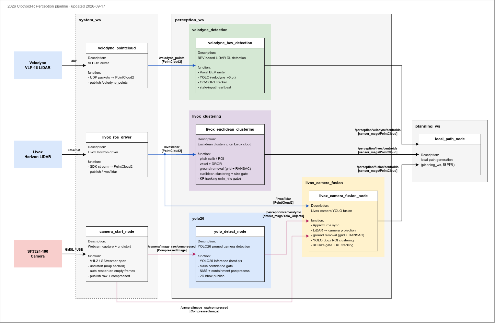

# 2026 Clothoid-R Perception

Clothoid-R 자율주행 시스템의 Perception ROS workspace.  
카메라와 LiDAR 기반 객체 검출, 클러스터링, 추적, 센서 퓨전 패키지로 구성됩니다.

## Team

<div align="center">
<table align="center">
<tr>
<td align="center" width="180">
  <a href="https://github.com/JaGyeong1024"><br /><sub><b>구자경</b></sub></a><br />Perception Architecture
</td>
<td align="center" width="180">
  <a href="https://github.com/Minjea31"><br /><sub><b>김민재</b></sub></a><br />Computer Vision, <br />Model Optimization
</td>
<td align="center" width="180">
  <a href="https://github.com/esem5377"><br /><sub><b>김은수</b></sub></a><br />Computer Vision, <br />Model Optimization
</td>
<td align="center" width="180">
  <a href="https://github.com/ysjee0229"><br /><sub><b>지연수</b></sub></a><br />Computer Vision, <br />Edge Deployment
</td>
</tr>
<tr>
<td align="center" width="180">
  <a href="https://github.com/heojy"><br /><sub><b>허주영</b></sub></a><br />Camera-LiDAR<br />Sensor Fusion
</td>
<td align="center" width="180">
  <br /><sub><b>김제은</b></sub><br />
</td>
<td align="center" width="180">
  <br /><sub><b>진채민</b></sub><br />
</td>
</tr>
</table>
</div>

## Pipeline



| Pipeline | Input | Output | Package |
|---|---|---|---|
| Camera publish | SF3324-100 camera | `/camera/image_raw`, `/camera/image_raw/compressed` | `camera_start` |
| Camera YOLO | `/camera/image_raw/compressed` | `/perception/camera/yolo` | `yolo26` |
| Livox clustering | `/livox/lidar` (Livox Horizon) | `/perception/livox/centroids` | `livox_clustering` |
| Livox-camera fusion | `/livox/lidar`, `/camera/image_raw/compressed`, `/perception/camera/yolo` | `/perception/fusion/centroids` | `livox_camera_fusion` |
| Velodyne BEV detection | `/velodyne_points` (Velodyne VLP-16) | `/perception/velodyne/centroids` | `velodyne_detection` |

## Layout

| Path | Contents |
|---|---|
| `perception_ws/` | Perception packages and the custom ultralytics (`yolo26/`) |
| `system_ws/` | Sensor drivers: `camera_start`, `livox_ros_driver`, `velodyne` |
| `2026_pipeline.drawio`, `2026_pipeline.png` | Pipeline diagram (generated by `tools/gen_pipeline_drawio.py`) |

## Packages

`perception_ws/src`:

| Package | Role |
|---|---|
| `perception_bringup` | Bringup launch for fusion and clustering |
| `detect_msgs` | Shared perception messages |
| `yolo26` | Camera YOLO26 detection |
| `livox_clustering` | Livox point cloud clustering and tracking |
| `livox_camera_fusion` | Livox-camera YOLO fusion |
| `velodyne_detection` | Velodyne BEV YOLO detection with OC-SORT tracking |

`system_ws/src`:

| Package | Role |
|---|---|
| `camera_start` | Camera capture and undistortion publisher (reopens the device on empty frames) |
| `livox_ros_driver` | Livox LiDAR driver |
| `velodyne` | Velodyne VLP-16 driver (`velodyne_pointcloud`) |

## Output Topics

| Topic | Type |
|---|---|
| `/perception/camera/yolo` | `detect_msgs/Yolo_Objects` |
| `/perception/livox/centroids` | `sensor_msgs/PointCloud` |
| `/perception/fusion/centroids` | `sensor_msgs/PointCloud` |
| `/perception/velodyne/centroids` | `sensor_msgs/PointCloud` |

## Requirements

Host requirements for the Docker workflow (recommended):

| Item | Requirement |
|---|---|
| OS | Ubuntu (host version does not matter — the container ships 20.04) |
| GPU | NVIDIA GPU, driver **535 or newer** (required by the cu121 torch wheels) |
| Docker | Docker Engine + [nvidia-container-toolkit](https://docs.nvidia.com/datacenter/cloud-native/container-toolkit/latest/install-guide.html) |
| Git | |
| Disk | **20 GB** free |

macOS is not supported (no NVIDIA GPU). Windows works through WSL2 + Docker Desktop but needs extra setup for GUI and GPU passthrough.

For a native install instead, you need Ubuntu 20.04 + ROS Noetic — see Native Setup below.

## Docker (recommended)

Reproduces the vehicle (cnu) environment. Nothing is installed on the host.

```bash
git clone https://github.com/JaGyeong1024/2026-Clothoid-R-Perception.git
cd 2026-Clothoid-R-Perception

./docker/clothoid.sh build     # first time only: pull base image + install python deps (10-20 min)
./docker/clothoid.sh           # enter the container; this is all you need afterwards
```

The container persists. Running the script from several terminals attaches to the **same container**, so you can start each node in its own terminal exactly as on the vehicle.

The repo is mounted at `/home/cnu/clothoid-r-perception` inside the container. **Edit on the host, build and run in the container.** Update code with `git pull` on the host.

| Command | Action |
|---|---|
| `./docker/clothoid.sh` | Enter (creates the container if missing, starts it if stopped) |
| `./docker/clothoid.sh build` | Build the dev image |
| `./docker/clothoid.sh stop` | Stop the container |
| `./docker/clothoid.sh rm` | Remove the container (image is kept) |

Layout:

| File | Contents |
|---|---|
| `docker/Dockerfile.base` | Ubuntu 20.04 + ROS Noetic + build dependencies. This is the image published to the registry |
| `docker/Dockerfile.dev` | base + the python stack. Built locally by each developer |
| `docker/requirements-system.txt` | System python3.8 pins (livox_clustering, velodyne_detection) |
| `docker/requirements-yolo.txt` | conda `yolo` env python3.10 pins (yolo26) |

The pins were taken from `pip freeze` on the cnu PC used for the competition run (2026-09-17). To change a dependency, edit the requirements file — the base image does not need to be rebuilt.

Sensors are not available inside the container, so develop against rosbags. Note that the pipeline is verified by building all 15 packages in the container; sensor-dependent behaviour still has to be checked on the vehicle.

## Native Setup

ROS environment:

```bash
source /opt/ros/noetic/setup.bash
```

System packages:

```bash
sudo apt update
sudo apt install -y \
  wget \
  git \
  build-essential \
  cmake \
  python3-pip \
  python3-rosdep \
  ros-noetic-cv-bridge \
  ros-noetic-pcl-ros \
  ros-noetic-pcl-conversions \
  ros-noetic-message-filters \
  ros-noetic-dynamic-reconfigure \
  ros-noetic-visualization-msgs
```

rosdep:

```bash
sudo rosdep init
rosdep update
```

Miniconda:

```bash
wget https://repo.anaconda.com/miniconda/Miniconda3-latest-Linux-x86_64.sh -O /tmp/miniconda.sh
bash /tmp/miniconda.sh -b -p $HOME/anaconda3
source $HOME/anaconda3/etc/profile.d/conda.sh
conda init bash
```

Repository clone:

```bash
git clone https://github.com/JaGyeong1024/2026-Clothoid-R-Perception.git
cd 2026-Clothoid-R-Perception
```

ROS dependencies:

```bash
rosdep install --from-paths perception_ws/src system_ws/src --ignore-src -r -y
```

System python3 dependencies (for `livox_clustering` and `velodyne_detection`):

```bash
sudo python3 -m pip install --no-cache-dir \
  --extra-index-url https://download.pytorch.org/whl/cu121 \
  'typing-extensions==4.13.2' 'numpy>=1.24,<1.25' 'pillow>=10.0,<11.0' \
  'scikit-learn>=1.3,<1.4' \
  torch==2.4.1+cu121 torchvision==0.19.1+cu121 \
  ultralytics==8.4.51 ultralytics-thop==2.0.19 opencv-python==4.13.0.92 \
  filterpy==1.4.5 lap==0.5.12
```

YOLO env: the `yolo26` node runs in a conda env through its shebang (`#!/home/cnu/anaconda3/envs/yolo/bin/python`). That env needs:
- the custom ultralytics in `perception_ws/yolo26` (referenced by `yolo_detect.py` with a relative path)
- `torch`, `numpy`, `opencv-python`, `rospkg`, `ultralytics-thop` (see `docker/requirements-yolo.txt`)

OC-SORT:

```bash
sudo git clone https://github.com/noahcao/OC_SORT /opt/OC_SORT
```

Workspace build:

```bash
source /opt/ros/noetic/setup.bash
cd system_ws && catkin_make && source devel/setup.bash && cd ..
cd perception_ws && catkin_make && source devel/setup.bash && cd ..
```

## Run

Start the sensor drivers (`system_ws`) first, then each perception node in its own terminal:

```bash
roslaunch livox_ros_driver livox_lidar.launch          # system_ws
roslaunch velodyne_pointcloud VLP16_points.launch      # system_ws
roslaunch camera_start start.launch                    # system_ws: camera + undistort
roslaunch perception_bringup perception.launch         # fusion + livox_clustering
rosrun velodyne_detection velodyne_bev_detection.py    # system python3
rosrun yolo26 yolo_detect.py                           # conda yolo env via shebang
```

Common node parameters (`_name:=value` for rosrun, args for launch):

```bash
rosrun yolo26 yolo_detect.py _show_image:=true          # show detection window (default false, headless)
rosrun yolo26 yolo_detect.py _imgsz:=960                # inference size (default 0 = native resolution)
rosrun velodyne_detection velodyne_bev_detection.py _stale_timeout:=0.5   # seconds without input before publishing empty
roslaunch velodyne_detection velodyne_detection.launch model_version:=velodyne_v6
```

Notes:
- `livox_clustering` track gating (`tracker_min_hits`, default 3) and size gates live in `config/livox_clustering.yaml`.
- Nodes started by launch files (`camera_start`, fusion, clustering, velodyne) have `respawn="true"` and restart 2 s after exiting.

Sensor topic override:

```bash
roslaunch perception_bringup perception.launch \
  livox_lidar_topic:=/livox/lidar \
  camera_image_topic:=/camera/image_raw/compressed
```

## Launch Arguments

`perception.launch`:

| Argument | Default |
|---|---|
| `livox_lidar_topic` | `/livox/lidar` |
| `camera_image_topic` | `/camera/image_raw/compressed` |
| `camera_yolo_topic` | `/perception/camera/yolo` |
| `livox_centroid_topic` | `/perception/livox/centroids` |
| `fusion_centroid_topic` | `/perception/fusion/centroids` |
| `fusion_projection_config` | `$(find livox_camera_fusion)/config/projection.yaml` |
| `livox_clustering_config` | `$(find livox_clustering)/config/livox_clustering.yaml` |

See the `<arg>` block at the top of `livox_camera_fusion.launch`, `livox_clustering.launch` and `velodyne_detection.launch` for their own arguments.

## Verification

```bash
rosnode list
```

```text
/camera_start_node
/yolo_detect_node
/livox_camera_fusion
/livox_euclidean_clustering
/velodyne_bev_detection_<id>     # anonymous node, suffix varies
```

```bash
rostopic hz /camera/image_raw/compressed
rostopic info /perception/camera/yolo
rostopic info /perception/livox/centroids
rostopic info /perception/fusion/centroids
rostopic info /perception/velodyne/centroids
```
